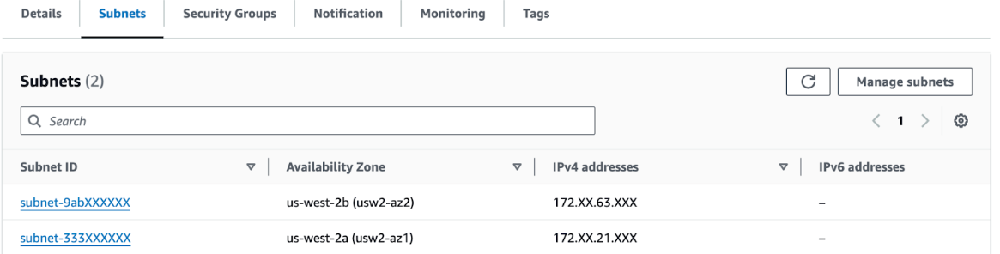
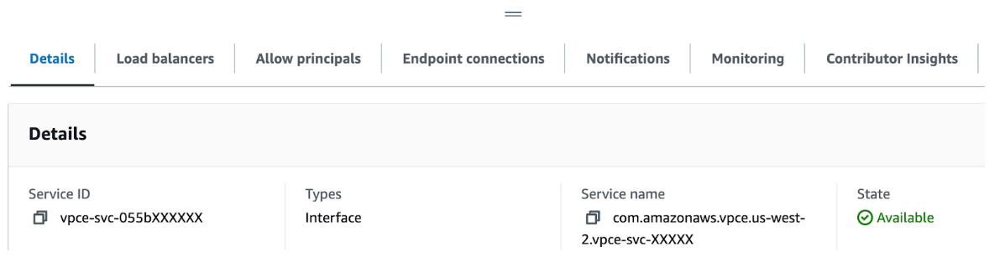

# Introduction

This repository contains the CDK script and instructions on how to configure an Amazon Bedrock Knowledge Base with PrivateLink connecting to MongoDB Atlas. 


# Solution Architecture

Amazon Bedrock can connect to your Knowledge Base over the Internet and via a PrivateLink.  To connect over the PrivateLink, we need to create an Endpoint Service.  This Endpoint Service needs to be backed by a Network Load Balancer forwarding traffic to MongoDB Atlas PrivateLink. 


# Prerequisites

* [MongoDB Atlas Account](https://www.mongodb.com/cloud/atlas/register)
* [AWS Account](https://portal.aws.amazon.com/billing/signup)
* [AWS CLI](https://aws.amazon.com/cli/)
* [NPM](https://www.npmjs.com/get-npm)
* [Node.js](https://nodejs.org/en/download/)
* [AWS CDK](https://docs.aws.amazon.com/cdk/latest/guide/getting_started.html)


# Implementation Steps

Ensure you read the [blog](https://www.mongodb.com/developer/products/atlas/rag-workflow-with-atlas-amazon-bedrock/) , before implementing the below steps.

The steps below describe the required configuration.

* Configure the [PrivateLink connection in MongoDB Atlas](https://aws.amazon.com/blogs/apn/connecting-applications-securely-to-a-mongodb-atlas-data-plane-with-aws-privatelink/).  Note the VPC ID of the VPC where you create the PL.

* Once PrivateLink configuration is done, in AWS Console, navigate to VPC | Endpoints.  Select your MongoDB Atlas endpoint and select the Subnets tab.  Note the IP addresses and the AZs, we use them later in the configuration.



* Next, look up the ports for your MongoDB Atlas cluster, by running the command below. Replace the values for XXXX to that of your MongoDB Atlas server.

```
nslookup -type=SRV _mongodb._tcp.XXXXX-pl-0.XXXX.mongodb.net
```
The command  produces output as follows:
```
Server:		10.XXX.XX.XX
Address:	10.XXX.XX.XX#53

Non-authoritative answer:
_mongodb._tcp.cluster2-pl-0.XXXX.mongodb.net	service = 0 0 1030 pl-0-us-west-2.XXXX.mongodb.net.
_mongodb._tcp.cluster2-pl-0.XXX.mongodb.net	service = 0 0 1031 pl-0-us-west-2.XXXX.mongodb.net.
_mongodb._tcp.cluster2-pl-0.XXXX.mongodb.net	service = 0 0 1032 pl-0-us-west-2.XXXX.mongodb.net
```

* The ports in this case are 1030, 1031, and 1032.  They might be different in your case.

* Next use the CDK script in this repo to create Service Endpoint fronting your PrivateLink Endpoint.  In order to run the script, you need the information you collected in the previous steps: VPC ID, MongoDB Atlas cluster ports, AZs, and PL IPs.

# Running the script
## Step 1
Update the .env file 

```
AWS_ACCOUNT_ID = "XXXXXX" # the AWS account ID
AWS_REGION = "us-east-1" # the AWS region

# VPC / VPCE configuration
VPC_ID="vpc-XXXXXX" # the VPC ID where the VPC endpoints will be created
AVAILABILITY_ZONES = "us-east-1a,us-east-1b" # the availability zones where the VPC endpoints will be created
PORTS = "1024, 1025, 1026" # the ports that will be opened in the security group
VPCE_IPS = "10.x.x.x,10.x.x.x" # the IPs of the VPC endpoints
```
## Step 2

`cdk bootstrap`

## Step 3

`cdk deploy`

# Bedrock KB Configuration
* Note: The customer’s VPC endpoint service must be in the same account as the knowledge base. For preventing a VPC endpoint service from being re-used across multiple knowledge bases within the same AWS account, customers can utilize the [bedrock:ThirdPartyKnowledgeBaseCredentialsSecretArn](https://docs.aws.amazon.com/service-authorization/latest/reference/list_amazonbedrock.html#amazonbedrock-bedrock_ThirdPartyKnowledgeBaseCredentialsSecretArn) condition key.
  

* When the script completes, in AWS Console | CloudFormation, navigate to Resources tab and click on the vpce link


* Select your service endpoint and note the service name on the details page.


* Proceed with the configuration of the KB in Bedrock as per [blog](https://www.mongodb.com/developer/products/atlas/rag-workflow-with-atlas-amazon-bedrock). When asked for Hostname enter the PrivateLink DNS name.  It looks something like `cluster2-pl-0.XXXX.mongodb.net `. The rest of the configuration is same, with an additional step where you supply PrivateLink service name.  Here you supply the Endpoint Service name, that you have configured with this script:


* Complete the rest of the steps as per the [blog](https://www.mongodb.com/developer/products/atlas/rag-workflow-with-atlas-amazon-bedrock).

# Conclusion
 When you complete, the configuration ensures your data stays private and does not travel over the Internet.

# Cleanup
* Run the command below to delete the resources.
`cdk destroy --all`


# CDK Useful commands

* `npm run build`   compile typescript to js
* `npm run watch`   watch for changes and compile
* `npm run test`    perform the jest unit tests
* `npx cdk deploy`  deploy this stack to your default AWS account/region
* `npx cdk diff`    compare deployed stack with current state
* `npx cdk synth`   emits the synthesized CloudFormation template
